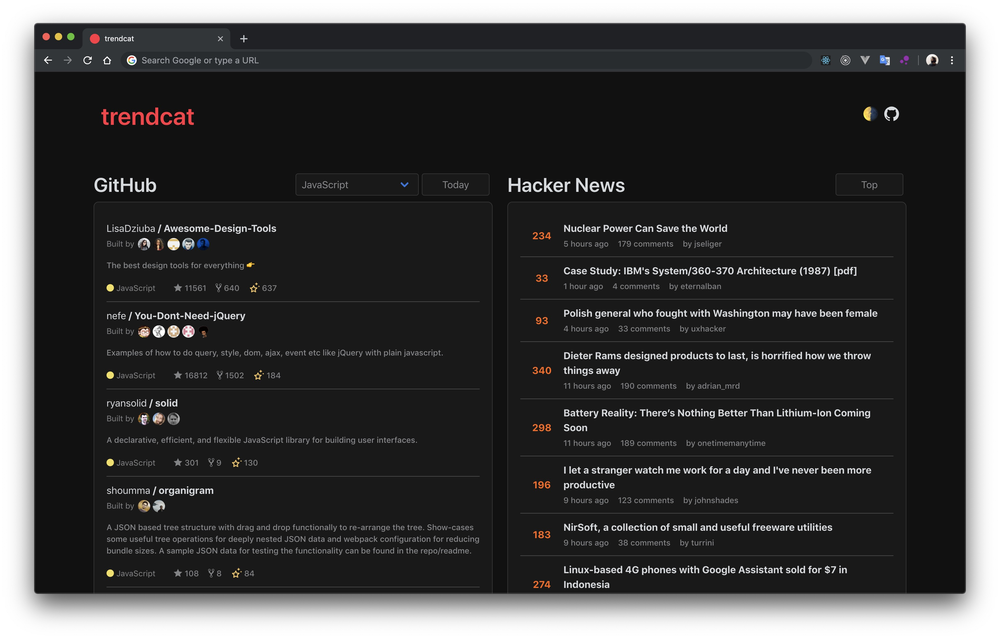
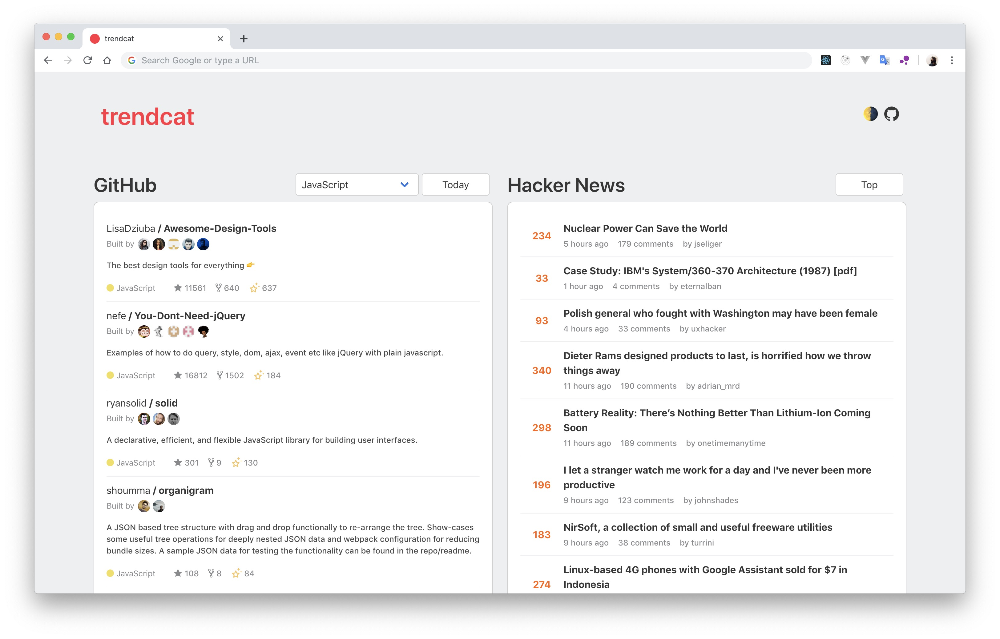

[](https://app.netlify.com/sites/trendcat/deploys)


## Trendcat
### A new tab extension for Github and HackerNews with Reagent

## Install
- [Chrome Web Store](https://chrome.google.com/webstore/detail/trendcat/efpdjmbhdeindmfegilaloknlpfloefd)
- [Firefox Add-ons](https://addons.mozilla.org/en-US/firefox/addon/trendcat/)


#### Dark Mode


#### Light Mode


### Development mode

To start the Figwheel compiler, navigate to the project folder and run the following command in the terminal:

```
lein figwheel
```

Figwheel will automatically push cljs changes to the browser.
Once Figwheel starts up, you should be able to open the `public/index.html` page in the browser.

### REPL

The project is setup to start nREPL on port `7002` once Figwheel starts.
Once you connect to the nREPL, run `(cljs)` to switch to the ClojureScript REPL.

### Building for production

```
lein clean
lein package
```

### Changelog

#### **v2.4.0**

- Github api url changes
- Move rust to favorite languages

#### **v2.3.0**

- Word break fix

#### **v2.2.0**

- New Settings Modal
- Digital Clock Splash Screen (Optional)
- Request Delay (Optional)

#### **v2.1.0**

- Redesigned Light Theme
- New Dark Theme

#### **v2.0.0**

- New Hacker News Column

#### **v1.0.0**

- Github Trending Feed
